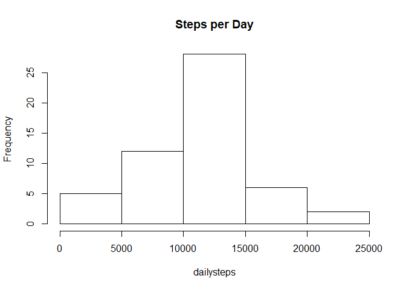
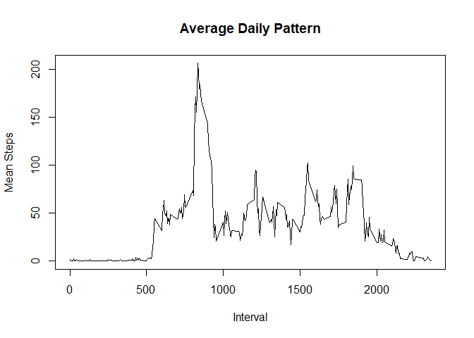
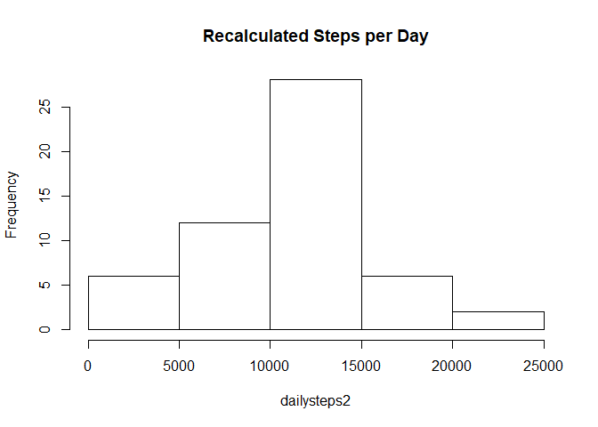
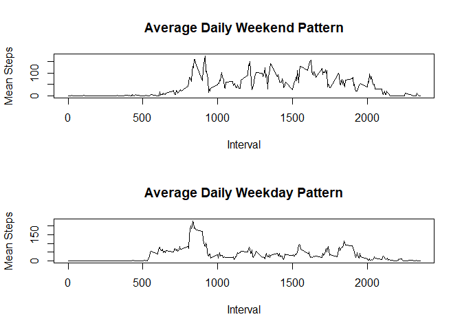

## Loading and preprocessing the data

```r
activity<- read.csv("activity.csv")
par(mfrow=c(1,1))
```

## What is mean total number of steps taken per day?

### Total number of steps taken histogram

```r
dailysteps<-with(activity,tapply(steps,date,sum))
hist(dailysteps,main="Steps per Day")
```

<!-- -->

```r
meansteps<-mean(dailysteps,na.rm=TRUE)
mediansteps<-median(dailysteps,na.rm=TRUE)
```
### Mean: 

```
## [1] 10766.19
```
### Median: 

```
## [1] 10765
```

## What is the average daily activity pattern?
### 1.

```r
avgdaily <- with(activity, tapply(steps,interval, mean, na.rm=TRUE))
plot(as.numeric(names(avgdaily)),avgdaily,type="l",main="Average Daily Pattern", ylab="Mean Steps", xlab="Interval")
```

<!-- -->
### 2.

```r
int<- names(sort(avgdaily,decreasing=TRUE))[1]
int2<-sort(avgdaily, decreasing = TRUE)[1]
```
Interval 835, on average across all the days in the dataset, contains the maximum number of steps: 206.1698113

## Inputting missing values
### 1.

```r
missing<-sum(is.na(activity$steps))
```
The number of missing values is 2304

### 2. 
We will use mean across all intervals to fill the NA values

### 3.
The new dataset code is:

```r
activity2<-activity
for(i in 1:dim(activity2)[1]) {
  if(is.na(activity2$steps[i])) activity2$steps[i]<-avgdaily[i/5+1]
}
```

### 4.
Recalculate Histogram

```r
dailysteps2<-with(activity2,tapply(steps,date,sum))

hist(dailysteps2,main="Recalculated Steps per Day")
```

<!-- -->

```r
meansteps2<-mean(dailysteps2,na.rm=TRUE)
mediansteps2<-median(dailysteps2,na.rm=TRUE)
```
New Mean is: 1.0570036\times 10^{4} and the new Median is 1.06825\times 10^{4}.

There values are slightly different. The mean and medians without NA data was being pushed higher. filling in the data with averages across all days normalizes the data to some extent, and provides a more realistic outcome.

## Are there differences in activity patterns between weekdays and weekends?
### 1. 

```r
activity2$day<- weekdays(as.Date(activity2$date))
activity2$day<- ifelse(activity2$day=="Saturday"|activity2$day=="Sunday", "Weekend","Weekday")
avgdaily2weekend <- tapply(activity2[activity2$day=="Weekend",]$steps,activity2[activity2$day=="Weekend",]$interval,mean,na.rm=TRUE)
avgdaily2weekday<-tapply(activity2[activity2$day=="Weekday",]$steps,activity2[activity2$day=="Weekday",]$interval,mean,na.rm=TRUE)
```

### 2.

```r
par(mfrow=c(2,1))
plot(as.numeric(names(avgdaily2weekend)),avgdaily2weekend,type="l",main="Average Daily Weekend Pattern", ylab="Mean Steps", xlab="Interval")
plot(as.numeric(names(avgdaily2weekday)),avgdaily2weekday,type="l",main="Average Daily Weekday Pattern", ylab="Mean Steps", xlab="Interval")
```

<!-- -->
The activity set on the Weekends and Weekdays are different.


